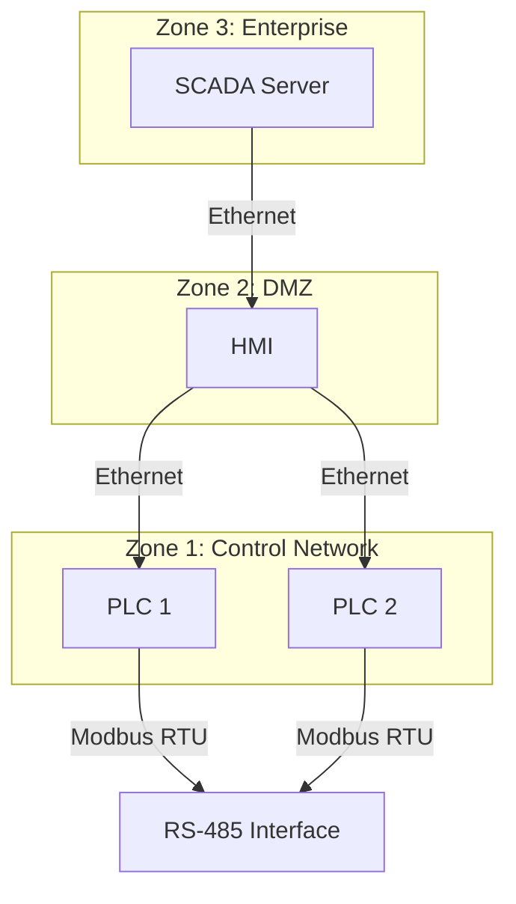

# Threat Modeling ICS

Instructions for AI security agents reviewing Microsoft Threat Modeling Tool threat-list exports.

> [!NOTE]
> Treat the Microsoft TMT CSV as the primary artifact. Preserve native TMT identifiers, titles, categories, descriptions, priorities, states, and analyst-entered notes. Perform review by appending new columns to the exported dataset rather than rewriting the model into a different structure.

- [1. Benefits](#1-benefits)
- [2. Principles](#2-principles)
- [3. Frameworks](#3-frameworks)
  - [3.1. Microsoft Threat Modeling Tool](#31-microsoft-threat-modeling-tool)
  - [3.2. STRIDE](#32-stride)
  - [3.3. MITRE ATT\&CK](#33-mitre-attck)
  - [3.4. CWE](#34-cwe)
  - [3.5. CVSS](#35-cvss)
- [4. Workflow](#4-workflow)
- [5. Deliverables](#5-deliverables)
- [6. Style Guide](#6-style-guide)
- [7. Example](#7-example)
  - [7.1. Threat Model Diagram](#71-threat-model-diagram)
- [8. Template](#8-template)
  - [8.1. Raw TMT Export CSV Template](#81-raw-tmt-export-csv-template)
  - [8.2. Reviewed TMT Export CSV Template](#82-reviewed-tmt-export-csv-template)
- [9. References](#9-references)

## 1. Benefits

- Safety-aware analysis
  > Captures not only cyber compromise, but also the potential physical-process, human-safety, environmental, quality, and availability consequences of a successful attack.

- End-to-End Traceability
  > Connects architecture elements, trust boundaries, threats, attacker behaviors, underlying weaknesses, severity scoring, and mitigations in a single workflow.

- Prioritization
  > Produces repeatable severity and remediation guidance that can feed security backlogs, engineering changes, exception reviews, and residual-risk decisions.

## 2. Principles

- CIA Triad
  > Focus on Confidentiality, Integrity, and Availability to ensure comprehensive security coverage.

- Purdue Model
  > Use the Purdue Model to classify assets, zones, and levels for accurate OT/ICS context.

## 3. Frameworks

### 3.1. Microsoft Threat Modeling Tool

Use Microsoft Threat Modeling Tool (TMT) as the source of truth for the initial threat inventory.

- Source of Record
  > The exported TMT CSV is the working dataset. Do not replace the exported row structure with a custom register unless explicitly requested.

- Preservation Rule
  > Keep native TMT fields exactly as exported whenever possible, including header names, row order, identifiers, titles, category values, and descriptions.

- Review Rule
  > Review is additive. Append analyst review fields after the native export columns.

### 3.2. STRIDE

Use STRIDE as the taxonomy for the initial threat statements generated by TMT.

- Spoofing
  > Illegitimate use of an identity, endpoint, process, or trust relationship.

- Tampering
  > Unauthorized modification of data, messages, logic, configuration, or execution inputs.

- Repudiation
  > Inability to prove an action, source, or responsibility.

- Information Disclosure
  > Exposure of information to an unauthorized party.

- Denial Of Service
  > Interruption, degradation, blocking, or exhaustion affecting availability.

- Elevation Of Privilege
  > Gain of permissions beyond the intended security boundary.

### 3.3. MITRE ATT&CK

MITRE ATT&CK for ICS to map a TMT threat to realistic adversary behavior affecting industrial environments.

- [Tactics](https://attack.mitre.org/tactics/ics/) and [Techniques](https://attack.mitre.org/techniques/ics/)
  > Record the most relevant ATT&CK for ICS tactic and technique IDs for access, execution, discovery, lateral movement, command and control, impair process control, inhibit response function, and impact.

  > [!NOTE]
  > Add a MITRE technique ID only when the threat statement and justification support a concrete technique or sub-technique. Leave the MITRE field blank when the row is too generic, ambiguous, or purely design-level without a reliable ATT&CK mapping.

### 3.4. CWE

Use [MITRE CWE](https://cwe.mitre.org/) to classify the underlying weakness that enables the threat.

Use CWE to identify the root weakness that makes the threat plausible or exploitable.

- Weakness Rule
  > Prefer the most specific CWE supported by the row description and analyst justification.

- Multi-CWE Rule
  > Multiple CWE IDs may be recorded when the reviewed finding depends on more than one concrete weakness.

### 3.5. CVSS

Use [FIRST CVSS v4.0](https://www.first.org/cvss/) to score each reviewed threat when a meaningful exploitability and impact assessment can be made.

- [CVSS Calculation](https://www.first.org/cvss/calculator/4.0)
  > Use the CVSS v4.0 calculator to determine the base score, severity, and vector based on the modeled attack scenario and review rationale.

- CVSS Score
  > Record the CVSS v4.0 base score as a numeric value between `0.0` and `10.0` when the evidence supports a defensible score.

- CVSS Severity
  > Record the CVSS v4.0 severity category (`None`, `Low`, `Medium`, `High`, `Critical`) when a base score is recorded.

- CVSS Vector
  > Record the CVSS v4.0 vector string (`CVSS:4.0/AV:N/AC:L/AT:N/PR:N/UI:N/VC:N/VI:N/VA:N/SC:N/SI:N/SA:N`) when a base score is recorded.

- Base Metrics
  > Score the intrinsic characteristics of the exploitable condition.

- Rationale Rule
  > The justification text should make the selected vector understandable from the modeled interaction and threat description.

## 4. Workflow

1. Threat Model Diagram

    Create a Mermaid threat model diagram of the OT/ICS control system. Define architecture elements, trust boundaries, data flows, and interfaces. Prefer filenames such as `<device-name>-threat-model.md`. If the model is not present, ask the user to provide external documentation, links, or a textual description of the system architecture and trust relationships. Proceed with the next step if the threat model is available.

2. Confirm the artifact type

   Determine whether the input is a raw Microsoft TMT export, a partially reviewed file, or a completed review file. Prefer filenames such as `<device-name>-model.csv` and `<device-name>-threat-model-review.csv` when present, but rely on the header row rather than the filename alone. If the CSV file is not present, ask the user to provide the exported TMT CSV for review.

3. Detect the native TMT columns

   Expect native fields such as:

   - `Id`
   - `Title`
   - `Category`
   - `Diagram`
   - `Interaction`
   - `Priority`
   - `State`
   - `Changed By`
   - `Description`
   - `Justification`
   - `Last Modified`

   Preserve the exact source header spelling and order found in the file.

4. Detect review columns already present

   A reviewed file (`<device-name>-threat-model-review.csv`) may append fields such as:

   - `ATT&CK ID`
   - `CWE ID`
   - `CVSS v4.0 Score`
   - `CVSS v4.0 Severity`
   - `CVSS v4.0 Vector`

   If those columns already exist, update them in place rather than creating duplicates.

5. Preserve the raw export non-destructively

   Do not delete native TMT columns or overwrite `Title`, `Category`, `Description`, `Priority`, or `Interaction` with rewritten text. Analyst review belongs in `Justification` in the security review csv (`<device-name>-threat-model-review.csv`).

6. Review each row

   Read the row using the native TMT fields together:

   - `Title`
     > The `Title` is the initial threat statement generated by TMT. It should be read as a single unit together with the `Description` to understand the modeled attack scenario.

   - `Category`
     > The `Category` is the STRIDE classification assigned by TMT.

   - `Interaction`
     > The `Interaction` field describes the data flow or trust relationship associated with the threat. It provides critical context for understanding the attack vector and potential mitigations.

   - `Description`
     > The `Description` provides additional details about the threat, including potential consequences and high-level mitigation suggestions. It should be read as a single unit together with the `Category` and `Title` to understand the modeled attack scenario.

   - `Priority`
     > The `Priority` field indicates the initial risk ranking assigned by TMT. It may be used as a reference point but should not be treated as definitive without analyst review.

   - `State`
     > The `State` field captures the review status of the threat.

7. Review and update each `State`

   Use the existing dataset state vocabulary when present. Common values include:

   - `Not Started`
   - `Needs Investigation`
   - `Mitigated`
   - `Not Applicable`
   - `Transferred`

8. Review and update each `Priority`

   Use the existing dataset priority vocabulary when present. Common values include:

   - `Low`
   - `Medium`
   - `High`

9. Write a security-review `Justification`

   Fill `Justification` with a concise analyst statement that explains why the threat is accepted, mitigated, transferred, not applicable, or still under investigation. The justification should reference the modeled protocol, interface, trust relationship, validation behavior, or compensating control when known.

10. Add MITRE ATT&CK mapping

    Populate `ATT&CK ID` only when a concrete ATT&CK technique is supported by the reviewed row. Leave the field blank when no precise mapping is defensible.

11. Add CWE classification

    Populate `CWE ID` with one or more weakness identifiers when the root weakness is clear from the threat statement and review rationale. Use comma-separated values when multiple CWEs are materially relevant.

12. Score with CVSS v4.0

    Populate all three of the following together:

    - `CVSS v4.0 Score`
    - `CVSS v4.0 Severity`
    - `CVSS v4.0 Vector`

    Do not record a severity without a vector. Do not record a vector without a score.

13. Preserve blanks intentionally

    Blank fields are acceptable when the evidence is insufficient. It is better to leave `ATT&CK ID` or `CWE ID` empty than to force an unreliable mapping.

14. Produce the reviewed CSV

    Save the enriched result as a reviewed artifact such as `<device-name>-threat-model-review.csv`. Preserve delimiter, quoting, encoding, and header style as consistently as possible with the source file.

## 5. Deliverables

When asked to perform or assist with TMT threat review, produce the following as applicable.

1. Reviewed CSV

   A completed `<device-name>-threat-model-review.csv` that preserves the native TMT export and appends or updates review fields.

## 6. Style Guide

- Preserve native field names
  > Keep Microsoft TMT column names exactly as exported unless the user explicitly requests a renamed schema.

- Preserve native threat wording
  > Do not rewrite `Title` or `Description` into a different narrative style. Add interpretation in `Justification` instead.

- Append rather than transform
  > Prefer adding review columns over creating a parallel custom threat register.

- Be precise with mappings
  > Only add MITRE ATT&CK and CWE IDs that can be defended from the row contents and review rationale.

- Keep states recognizable
  > Use the state vocabulary already present in the file whenever possible.

- Respect incomplete evidence
  > Blank review fields are acceptable when a precise mapping or score cannot be supported.

- Keep justifications compact
  > A good justification is specific, technically grounded, and brief enough to remain readable in a CSV cell.

## 7. Example

### 7.1. Threat Model Diagram



## 8. Template

Use these templates for Microsoft TMT CSV intake and review.

### 8.1. Raw TMT Export CSV Template

```csv
Id,Title,Category,Diagram,Interaction,Priority,State,Changed By,Description,Justification,Last Modified
11,Spoofing the RS-485 Interface Process,Spoofing,Control Network,HMI -> RS-485 Interface,High,Not Started,,An adversary may spoof the RS-485 interface to inject malicious Modbus RTU frames and alter process control commands.,,2024-01-15
12,Tampering with Modbus RTU Data,Tampering,Control Network,PLC1 -> RS-485 Interface,High,Not Started,,An adversary with access to the RS-485 bus may modify in-transit Modbus RTU frames to alter register values or coil states.,,2024-01-15
13,Denial of Service on RS-485 Bus,Denial Of Service,Control Network,PLC2 -> RS-485 Interface,Medium,Not Started,,An adversary may flood or disrupt the RS-485 bus to prevent legitimate Modbus RTU communication between PLCs and the HMI.,,2024-01-15
14,Information Disclosure via Modbus RTU,Information Disclosure,Control Network,HMI -> PLC1,Low,Not Started,,An adversary may passively monitor unencrypted Modbus RTU traffic on the RS-485 bus to infer process state and control logic.,,2024-01-15
```

### 8.2. Reviewed TMT Export CSV Template

```csv
Id,Title,Category,Diagram,Interaction,Priority,State,Changed By,Description,Justification,Last Modified,ATT&CK ID,CWE ID,CVSS v4.0 Score,CVSS v4.0 Severity,CVSS v4.0 Vector
11,Spoofing the RS-485 Interface Process,Spoofing,Control Network,HMI -> RS-485 Interface,High,Needs Investigation,,An adversary may spoof the RS-485 interface to inject malicious Modbus RTU frames and alter process control commands.,"Modbus RTU has no native authentication. An attacker with physical or logical access to the RS-485 bus can transmit frames indistinguishable from a legitimate HMI. Compensating controls (serial tap detection, PLC input validation) partially mitigate. Risk accepted pending hardware-level mitigation.",2024-01-15,T0856,CWE-290,8.6,High,CVSS:4.0/AV:A/AC:L/AT:N/PR:N/UI:N/VC:N/VI:H/VA:H/SC:N/SI:H/SA:H
12,Tampering with Modbus RTU Data,Tampering,Control Network,PLC1 -> RS-485 Interface,High,Needs Investigation,,An adversary with access to the RS-485 bus may modify in-transit Modbus RTU frames to alter register values or coil states.,"Modbus RTU provides no integrity protection. An attacker with bus access can perform a man-in-the-middle attack by relaying and modifying frames. No CRC validation beyond the Modbus CRC16 which does not prevent deliberate manipulation by an in-path adversary.",2024-01-15,T0831,CWE-345,8.6,High,CVSS:4.0/AV:A/AC:L/AT:N/PR:N/UI:N/VC:N/VI:H/VA:N/SC:N/SI:H/SA:H
13,Denial of Service on RS-485 Bus,Denial Of Service,Control Network,PLC2 -> RS-485 Interface,Medium,Needs Investigation,,An adversary may flood or disrupt the RS-485 bus to prevent legitimate Modbus RTU communication between PLCs and the HMI.,"RS-485 is a shared bus with no access arbitration beyond Modbus master-slave polling. A device generating continuous traffic can prevent legitimate polling cycles. Physical access controls to the control cabinet limit exposure.",2024-01-15,T0814,CWE-400,6.9,Medium,CVSS:4.0/AV:A/AC:L/AT:N/PR:N/UI:N/VC:N/VI:N/VA:H/SC:N/SI:N/SA:H
14,Information Disclosure via Modbus RTU,Information Disclosure,Control Network,HMI -> PLC1,Low,Not Applicable,,An adversary may passively monitor unencrypted Modbus RTU traffic on the RS-485 bus to infer process state and control logic.,"Process data on this segment is not classified. Passive monitoring of register values does not provide meaningful advantage to an attacker without additional context. Physical access to the control cabinet is required. Risk accepted as Low.",2024-01-15,,CWE-311,3.8,Low,CVSS:4.0/AV:A/AC:H/AT:N/PR:N/UI:N/VC:L/VI:N/VA:N/SC:N/SI:N/SA:N
```

## 9. References

- Microsoft [Threat Modeling Tool](https://learn.microsoft.com/en-us/azure/security/develop/threat-modeling-tool) documentation.
- STRIDE [Threat Modeling](https://learn.microsoft.com/en-us/azure/security/develop/threat-modeling-tool-threats) guide.
- MITRE [ATT&CK for ICS](https://attack.mitre.org/matrices/ics/) matrix.
- MITRE [CWE](https://cwe.mitre.org/) weakness enumeration.
- FIRST [CVSS v4.0](https://www.first.org/cvss/v4.0/specification-document) specification.
- FIRST [CVSS v4.0 Calculator](https://www.first.org/cvss/calculator/4.0).
- Purdue [Reference Model](https://www.isa.org/standards-and-publications/isa-standards/isa-standards-committees/isa99) for ICS architecture.
