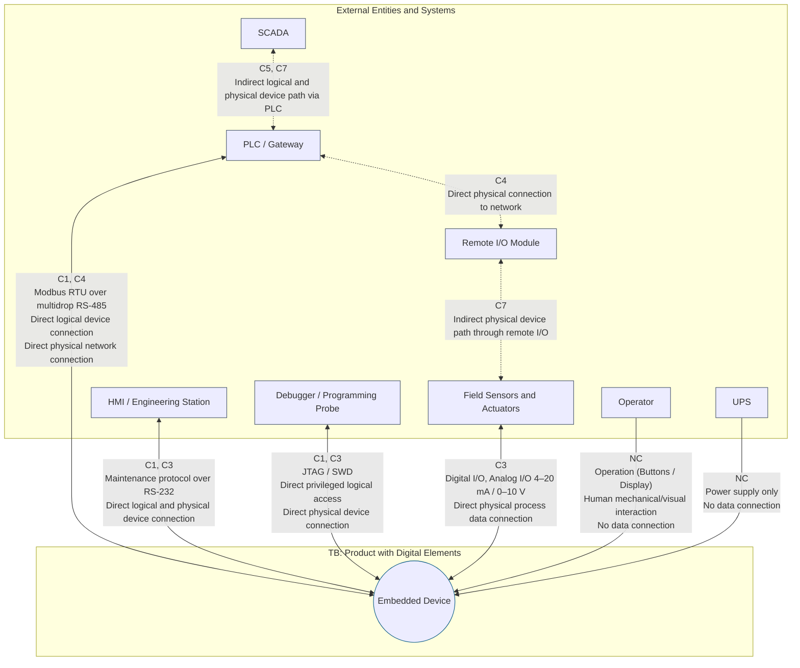
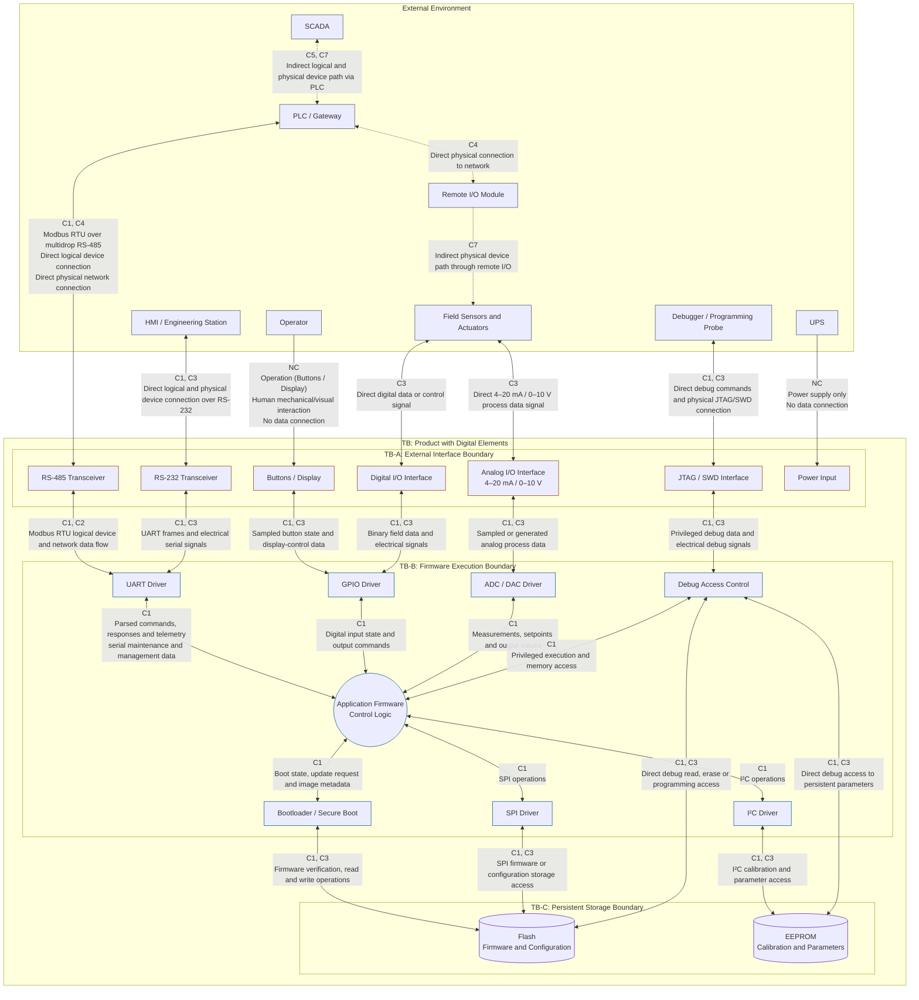

# Threat Depth Layers

- [1. Depth Layers](#1-depth-layers)
- [2. Diagram Layers](#2-diagram-layers)
  - [2.1. Depth Layer 0](#21-depth-layer-0)
  - [2.2. Depth Layer 2](#22-depth-layer-2)

> [!NOTE]
> Refer to the [Scope Classification](../SKILL.md#21-scope-classification) for Connection Path framework (C1–C8).

## 1. Depth Layers

[Diagram depth layers](https://learn.microsoft.com/en-us/training/modules/tm-provide-context-with-the-right-depth-layer/1b-depth-layers) are used to decompose a system into hierarchical levels of detail, enabling threat modeling at varying levels of abstraction.

| Layer | Title       | Components                                                                                                                                                                                                                                                                          | Description                                                                                                                                                                                                                                                                                                                                                                                                                                                                                                                                                     |
| ----- | ----------- | ----------------------------------------------------------------------------------------------------------------------------------------------------------------------------------------------------------------------------------------------------------------------------------- | --------------------------------------------------------------------------------------------------------------------------------------------------------------------------------------------------------------------------------------------------------------------------------------------------------------------------------------------------------------------------------------------------------------------------------------------------------------------------------------------------------------------------------------------------------------- |
| 0     | System      | Embedded Device, PLC, HMI/Engineering Station, Maintenance Workstation, Debug/Flash Probe, Managed UPS, Sensors, Actuators, Remote I/O, Protocol Gateway/Serial Server, USB Host or Service Laptop                                                                                  | Mandatory initial view of the systems major parts. Represents the Embedded Device as a single process within its trust boundary and shows all relevant external entities, intermediary systems, data flows, and physical or logical connection paths. Establishes the system context and identifies the Layer 0 processes that may require further decomposition.  ([Microsoft Layer 0][1])                                                                                                                                                                     |
| 1     | Process     | Controller/MCU, RS-485 Transceiver, RS-232 Transceiver, USB Interface, JTAG/SWD Interface, RJ-12/RJ-45 Connectors, GPIO Interface, Digital I/O, Analog I/O, Power Monitoring, Flash, EEPROM                                                                                         | Decomposes the Embedded Device process from Layer 0 into its principal board-level processes, interfaces, data stores, and trust boundaries. Identifies the products external physical and logical attack surfaces while retaining the Controller/MCU as a single process. Generally the appropriate minimum decomposition for evaluating an embedded product's communication ports, field I/O, debug interface, storage, and service interfaces.  ([Microsoft Layer 1][2])                                                                                     |
| 2     | Subprocess  | Application and Control Logic, Modbus RTU Stack, GPIO Driver, UART Driver, SPI Driver, I²C Driver, Digital-I/O Driver, ADC/DAC Driver, Scheduler/Interrupt Dispatch, Configuration Manager, Bootloader, Secure Boot, Firmware-Update Manager, Debug-Access Control, Memory Manager  | Decomposes the Controller/MCU process from Layer 1 into security-relevant firmware subprocesses and data flows. Focuses on protocol parsing, control decisions, privilege boundaries, interrupt handling, secure startup, firmware updates, debug authorization, configuration processing, and non-volatile-memory access. Appropriate where compromise of an internal controller function could affect device integrity, availability, process control, or connected systems.  ([Microsoft Layer 2][3])                                                        |
| 3     | Lower-Level | Modbus RTU Frame Parser and Function Handlers, Boot Verification Chain, Firmware-Update State Machine, Signature Verification, Anti-Rollback Logic, UART ISR/DMA and Buffers, GPIO Interrupt/Debounce Logic, SPI/I²C Transaction State Machines, MPU Regions, Key-Handling Routines | Provides minute implementation detail for a selected critical Layer 2 subprocess rather than automatically decomposing the entire controller. Examines parser memory safety, input-validation branches, state transitions, buffer ownership, concurrency, cryptographic verification, privilege changes, key exposure, fault injection, and side-channel behavior. Reserved for security-critical, kernel-level, privileged, cryptographic, or timing-sensitive functions where Layer 2 does not provide sufficient analytical depth.  ([Microsoft Layer 3][4]) |

[1]: https://learn.microsoft.com/en-us/training/modules/tm-provide-context-with-the-right-depth-layer/2-layer-0-the-system-layer "Layer 0 | The System Layer Training | Microsoft Learn"
[2]: https://learn.microsoft.com/en-us/training/modules/tm-provide-context-with-the-right-depth-layer/3-layer-1-the-process-layer "Layer 1 | The Process Layer Training | Microsoft Learn"
[3]: https://learn.microsoft.com/en-us/training/modules/tm-provide-context-with-the-right-depth-layer/4-layer-2-the-sub-process-layer "Layer 2 | The Subprocess Layer Training | Microsoft Learn"
[4]: https://learn.microsoft.com/en-us/training/modules/tm-provide-context-with-the-right-depth-layer/5-layer-3-the-lower-level-layer "Layer 3 | The Lower-Level Layer Training | Microsoft Learn"

## 2. Diagram Layers

### 2.1. Depth Layer 0

At depth layer 0, the embedded product is represented as a single system node. Internal elements such as the bootloader, Flash, EEPROM, protocol stack, drivers, and application firmware are intentionally omitted.

### 2.2. Depth Layer 2

At depth layer 2, the embedded device is decomposed into its major functional blocks (processes) and critical sub‑processes. Internal data flows, trust boundaries, and interfaces between components are shown, enabling detailed threat analysis of the device's attack surface and internal architecture.

