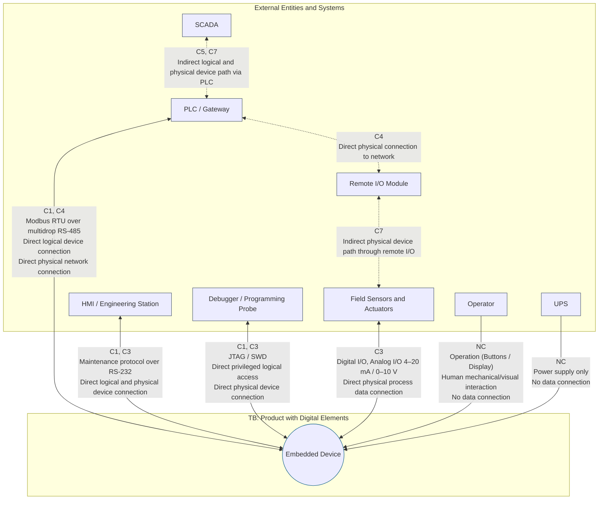
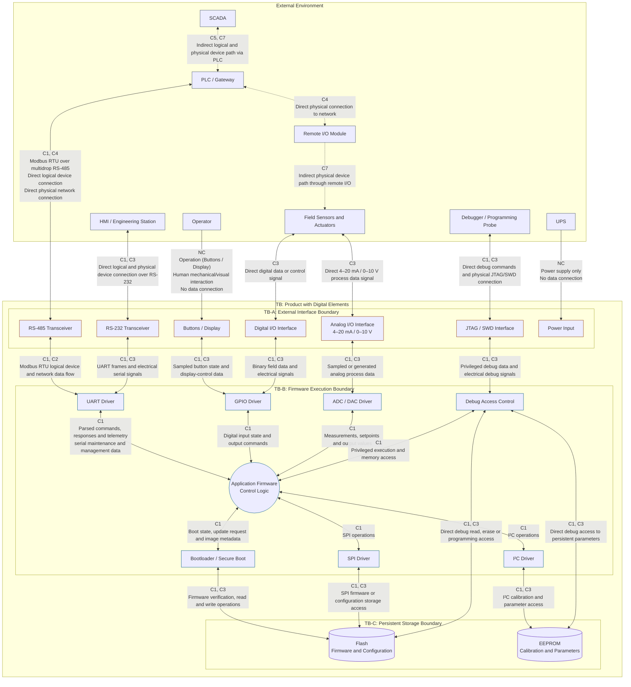

# Threat Depth Layers

- [1. Depth Layers](#1-depth-layers)
- [2. Diagram Layers](#2-diagram-layers)
  - [2.1. Depth Layer 0](#21-depth-layer-0)
  - [2.2. Depth Layer 2](#22-depth-layer-2)

> [!NOTE]
> Refer to the [Connection-Path Scope Classification](mapping-rules.md#1-connection-path-scope-classification) for Connection Path framework (C1–C8).

## 1. Depth Layers

Apply [Diagram Depth Layers](mapping-rules.md#3-diagram-depth-layers) for the canonical layer definitions, representative components, decomposition criteria, and Microsoft references. The examples below illustrate those classifications.

## 2. Diagram Layers

### 2.1. Depth Layer 0

At depth layer 0, the embedded product is represented as a single system node. Internal elements such as the bootloader, Flash, EEPROM, protocol stack, drivers, and application firmware are intentionally omitted.

```mermaid
flowchart TD
    %% ============================================================
    %% Threat-model depth: Layer 0 — System context
    %% ------------------------------------------------------------
    %% The embedded product is represented as one process.
    %% Internal firmware, storage, buses, and components are omitted.
    %% ------------------------------------------------------------
    %% C1-C8 are engineering labels, not CRA statutory categories.
    %% ============================================================

    %% ------------------------------------------------------------
    %% External entities
    %% ------------------------------------------------------------
    subgraph EXT["External Entities and Systems"]
        SCADA["SCADA"]
        PLC["PLC / Gateway"]
        HMI["HMI / Engineering Station"]
        PROBE["Debugger / Programming Probe"]
        RIO["Remote I/O Module"]
        FIELD["Field Sensors and Actuators"]
        USER["Operator"]
        UPS["UPS"]
    end

    %% ------------------------------------------------------------
    %% Product boundary
    %% ------------------------------------------------------------
    subgraph TB["TB: Product with Digital Elements"]
        DEVICE(("Embedded Device"))
    end

    %% ============================================================
    %% Direct logical and physical connections
    %% ============================================================

    PLC <-->|"C1, C4<br/>Modbus RTU over multidrop RS-485<br/>Direct logical device connection<br/>Direct physical network connection"| DEVICE

    HMI <-->|"C1, C3<br/>Maintenance protocol over RS-232<br/>Direct logical and physical device connection"| DEVICE

    PROBE <-->|"C1, C3<br/>JTAG / SWD<br/>Direct privileged logical access<br/>Direct physical device connection"| DEVICE

    FIELD <-->|"C3<br/>Digital I/O, Analog I/O 4–20 mA / 0–10 V<br/>Direct physical process data connection"| DEVICE

    %% ============================================================
    %% Indirect logical and physical connections
    %% ============================================================

    SCADA <-.->|"C5, C7<br/>Indirect logical and physical device path via PLC"| PLC

    PLC <-.->|"C4<br/>Direct physical connection to network"| RIO

    RIO <-.->|"C7<br/>Indirect physical device path through remote I/O"| FIELD

    %% ============================================================
    %% Non-qualifying interactions
    %% ============================================================

    USER -->|"NC<br/>Operation (Buttons / Display)<br/>Human mechanical/visual interaction<br/>No data connection"| DEVICE

    UPS -->|"NC<br/>Power supply only<br/>No data connection"| DEVICE

    %% ============================================================
    %% Visual classification
    %% ============================================================

    classDef external stroke:#475569;
    classDef product stroke:#075985;

    class PLC,RIO,HMI,SCADA,PROBE,FIELD,USER,UPS external;
    class DEVICE product;
```

### 2.2. Depth Layer 2

At depth layer 2, the embedded device is decomposed into its major functional blocks (processes) and critical sub‑processes. Internal data flows, trust boundaries, and interfaces between components are shown, enabling detailed threat analysis of the device's attack surface and internal architecture.

```mermaid
flowchart TD
    %% ============================================================
    %% Threat-model depth: Layer 2 — system subparts
    %% ------------------------------------------------------------
    %% Classification perspective:
    %% All C1-C8 labels are evaluated relative to the embedded device.
    %% ------------------------------------------------------------
    %% Solid external paths = direct connections
    %% Dashed paths         = indirect end-to-end reachability
    %% NC                   = not a device/network data connection
    %% ============================================================

    %% ============================================================
    %% External entities
    %% ============================================================
    subgraph EXTERNAL["External Environment"]
        SCADA["SCADA"]
        HMI["HMI / Engineering Station"]
        PLC["PLC / Gateway"]
        PROBE["Debugger / Programming Probe"]
        USER["Operator"]
        RIO["Remote I/O Module"]
        FIELD["Field Sensors and Actuators"]
        UPS["UPS"]
      end

      %% ============================================================
      %% Product with Digital Elements boundary
      %% ============================================================
      subgraph DEVICE["TB: Product with Digital Elements"]
          %% --------------------------------------------------------
          %% External interface trust boundary
          %% --------------------------------------------------------
          subgraph INTERFACES["TB-A: External Interface Boundary"]
              RS485["RS-485 Transceiver"]
              RS232["RS-232 Transceiver"]
              JTAG["JTAG / SWD Interface"]
              OPERATION["Buttons / Display"]
              DIO["Digital I/O Interface"]
              AIO["Analog I/O Interface<br/>4–20 mA / 0–10 V"]
              POWER["Power Input"]
          end

          %% --------------------------------------------------------
          %% Firmware and privileged execution boundary
          %% --------------------------------------------------------
          subgraph FIRMWARE["TB-B: Firmware Execution Boundary"]
              UARTDRV["UART Driver"]
              GPIODRV["GPIO Driver"]
              ANALOGDRV["ADC / DAC Driver"]
              SPIDRV["SPI Driver"]
              I2CDRV["I²C Driver"]
              APP(("Application Firmware<br/>Control Logic"))
              BOOT["Bootloader / Secure Boot"]
              DEBUGCTRL["Debug Access Control"]
          end

          %% --------------------------------------------------------
          %% Persistent-data trust boundary
          %% --------------------------------------------------------
          subgraph STORAGE["TB-C: Persistent Storage Boundary"]
              FLASH[("Flash<br/>Firmware and Configuration")]
              EEPROM[("EEPROM<br/>Calibration and Parameters")]
          end
      end

      %% ============================================================
      %% Indirect external paths
      %% ============================================================

      SCADA <-.->|"C5, C7<br/>Indirect logical and physical device path via PLC"| PLC

      PLC <-.->|"C4<br/>Direct physical connection to network"| RIO

      RIO -.->|"C7<br/>Indirect physical device path through remote I/O"| FIELD

      %% ============================================================
      %% Direct industrial communication paths
      %% ============================================================

      PLC <-->|"C1, C4<br/>Modbus RTU over multidrop RS-485<br/>Direct logical device connection<br/>Direct physical network connection"| RS485

      RS485 <-->|"C1, C2<br/>Modbus RTU logical device and network data flow"| UARTDRV

      HMI <-->|"C1, C3<br/>Direct logical and physical device connection over RS-232"| RS232

      PROBE <-->|"C1, C3<br/>Direct debug commands and physical JTAG/SWD connection"| JTAG

      %% ============================================================
      %% Direct field-I/O paths
      %% ============================================================

      FIELD <-->|"C3<br/>Direct digital data or control signal"| DIO
      FIELD <-->|"C3<br/>Direct 4–20 mA / 0–10 V process data signal"| AIO

      USER -->|"NC<br/>Operation (Buttons / Display)<br/>Human mechanical/visual interaction<br/>No data connection"| OPERATION

      UPS -->|"NC<br/>Power supply only<br/>No data connection"| POWER

      %% ============================================================
      %% Interface-to-driver flows
      %% ============================================================

      RS232 <-->|"C1, C3<br/>UART frames and electrical serial signals"| UARTDRV

      OPERATION <-->|"C1, C3<br/>Sampled button state and display-control data"| GPIODRV
      DIO <-->|"C1, C3<br/>Binary field data and electrical signals"| GPIODRV
      AIO <-->|"C1, C3<br/>Sampled or generated analog process data"| ANALOGDRV

      JTAG <-->|"C1, C3<br/>Privileged debug data and electrical debug signals"| DEBUGCTRL

      %% ============================================================
      %% Internal logical flows
      %% ============================================================

      UARTDRV <-->|"C1<br/>Parsed commands, responses and telemetry<br/>serial maintenance and management data"| APP
      GPIODRV <-->|"C1<br/>Digital input state and output commands"| APP
      ANALOGDRV <-->|"C1<br/>Measurements, setpoints and output values"| APP

      APP <-->|"C1<br/>Boot state, update request and image metadata"| BOOT
      APP <-->|"C1<br/>SPI operations"| SPIDRV
      APP <-->|"C1<br/>I²C operations"| I2CDRV

      DEBUGCTRL <-->|"C1<br/>Privileged execution and memory access"| APP

      %% ============================================================
      %% Persistent-storage flows
      %% ============================================================

      BOOT <-->|"C1, C3<br/>Firmware verification, read and write operations"| FLASH
      SPIDRV <-->|"C1, C3<br/>SPI firmware or configuration storage access"| FLASH
      I2CDRV <-->|"C1, C3<br/>I²C calibration and parameter access"| EEPROM

      DEBUGCTRL <-->|"C1, C3<br/>Direct debug read, erase or programming access"| FLASH
      DEBUGCTRL <-->|"C1, C3<br/>Direct debug access to persistent parameters"| EEPROM

      %% ============================================================
      %% Visual classification
      %% ============================================================

      classDef external stroke:#475569;
      classDef interface stroke:#92400e;
      classDef process stroke:#075985;
      classDef datastore stroke:#5b21b6;

      class PLC,SCADA,HMI,USER,PROBE,FIELD,RIO,UPS external;
      class RS485,RS232,JTAG,OPERATION,DIO,AIO,POWER interface;
      class UARTDRV,GPIODRV,ANALOGDRV,SPIDRV,I2CDRV,APP,BOOT,DEBUGCTRL process;
      class FLASH,EEPROM datastore;
```
