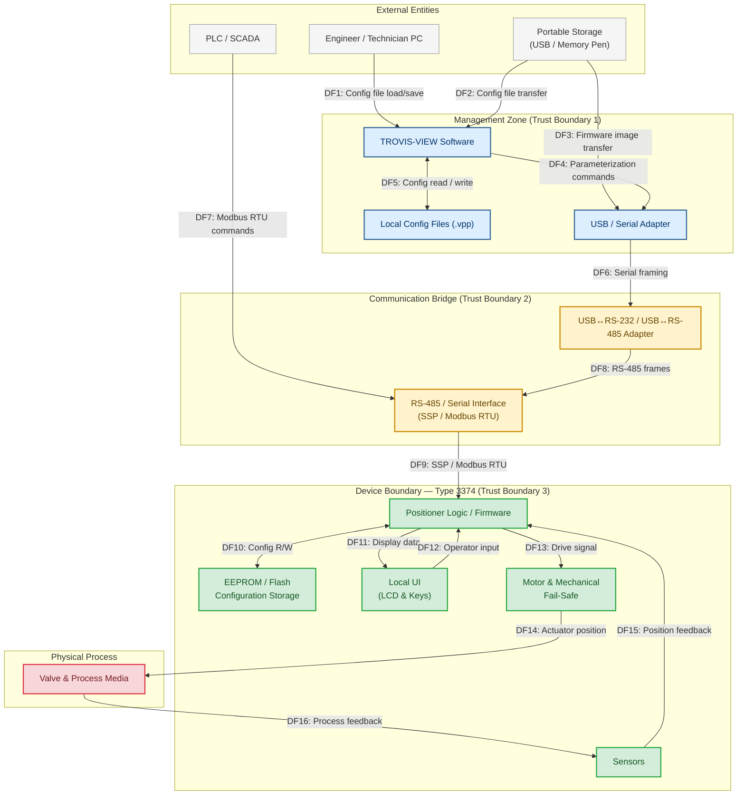

# Threat Modeling

Instructions for AI coding agents on performing threat modeling for OT/ICS systems using STRIDE, MITRE ATT&CK, CWE, and CVSS v4.0.

- [1. Prompts](#1-prompts)
  - [1.1. Prompt for Model](#11-prompt-for-model)
  - [1.2. Prompt for Security Review](#12-prompt-for-security-review)
  - [1.3. Prompt for MITRE ATT\&CK and CWE Mapping](#13-prompt-for-mitre-attck-and-cwe-mapping)
  - [1.4. Prompt for CVSS](#14-prompt-for-cvss)
- [2. Architecture Model](#2-architecture-model)

## 1. Prompts

### 1.1. Prompt for Model

Goal: Produce a complete STRIDE threat model and a render-ready Mermaid diagram for the SAMSON Type 3374 electrical actuator together with the TROVIS-VIEW configuration software.

Deliverables:

1. A Mermaid diagram (include the `%%{init:...}%%` block) modeling:
    - External entities: Engineer/Technician PC (TROVIS-VIEW), PLC/SCADA, portable storage (USB/Memory pen).
    - Management zone: TROVIS-VIEW, local config files (.vpp), USB/Serial adapter.
    - Communication bridge: USB<->RS-232 or USB<->RS-485 adapter, RS-485/Serial interface (SSP/Modbus RTU) on the actuator.
    - Device boundary: Type 3374 positioner logic/firmware, EEPROM/flash configuration storage, local UI (LCD & keys), motor & mechanical fail-safe, sensors and valve.
    - Physical process: Valve and process media.
    - Directed data flows with stable IDs (DF1, DF2, ...), and trust boundaries (management vs device vs physical).

2. A STRIDE mapping: for each relevant component or data flow list applicable STRIDE categories (Spoofing, Tampering, Repudiation, Information disclosure, Denial of service, Elevation of privilege), one-sentence attack example, severity (High/Medium/Low), and a concise mitigation (one line).

3. A short prioritized mitigation checklist (3–6 items) and any assumptions made (1–2 lines if a public detail is missing).

Formatting & constraints:

- Provide the Mermaid code block first (render-ready). Use `classDef` to differentiate trust boundaries and threats, and annotate threat-prone nodes/flows visually.
- Use clear DF IDs in the diagram so the STRIDE mapping can reference them directly.
- Keep Mermaid output under ~300 lines. Keep textual findings concise (1–2 sentences each).
- If a product detail is not public, state a reasonable assumption in one sentence and continue.

Reference guidance: Use the SAMSON Type 3374 product page and TROVIS-VIEW software page for interface and behavior context.

Example instruction line to the model: "If a detail is not public, state a reasonable assumption in one line and continue."

References:

- SAMSON [Type 3374](https://www.samsongroup.com/en/products/actuators/3374/) product page.
- SAMSON [TROVIS-VIEW](https://www.samsongroup.com/en/downloads/software-drivers/trovis-view/) software page.

### 1.2. Prompt for Security Review

Conduct a security review of the threats identified in the `.csv` threat modeling file. Update the dataset by refining the State, Priority levels and generate new, actionable Justification descriptions based on the specific threats, interactions (such as data flow communication), and standard operational technology (OT) security risks.

Role: Act as a Senior OT (Operational Technology) Security Architect.

Task: Perform a row-by-row security review of the provided threat-model `.csv` and update only `Priority`, `State`, and `Justification`.

Objective:

- Reassess each threat using OT context (industrial safety, process availability, integrity of setpoints, serial/Modbus risks, weak or absent authentication, insecure engineering workstations, removable media exposure).
- Produce consistent and actionable output that can be written back to the same `.csv` without changing schema.

Tech Stack:

- Microsoft TMT (Threat Modeling Tool)
- STRIDE

Input assumptions:

- The `.csv` contains threat entries with fields such as `Category`, `Interaction`, `Description`, and existing `Priority`, `State`, `Justification`.
- `Interaction` refer to specific data flow communication paths (for example USB, RS-485, Modbus RTU, firmware/config file transfer, Pub/Sub, Request/Response, local HMI/manual override).

Update rules (required):

1. Refine `Priority`
    - Use `Category`, `Interaction`, and `Description` together.
    - Assign `High` when exploitation could plausibly cause unsafe actuator movement, loss of control, major production disruption, or persistent compromise.
    - Assign `Medium` when impact is operationally meaningful but bounded/recoverable.
    - Assign `Low` when impact is limited, compensating controls are strong, or exploitation is unlikely in the current architecture.

2. Refine `State`
   The available states are `Not Started`, `Not Applicable`, `Needs Investigation` and `Mitigated`.
    - Assign `Not Started` when no analysis has been performed yet and the threat requires initial triage.
    - Assign `Needs Investigation` when the threat is credible but requires further analysis to confirm exploitability or impact.
    - Assign `Mitigated` when there is a clear, actionable control that can be implemented to reduce risk to an acceptable level.
    - Avoid `Not Applicable` unless the threat truly cannot occur in this context (for example, a web-based attack vector on a non-networked device).

3. Regenerate `Justification`
    - Write 1-2 concise sentences.

Output constraints (strict):

- Preserve all original rows and row order.
- Do not add or remove columns.
- Modify only `Priority`, `State`, and `Justification`.
- Use exact `Priority` values: `High`, `Medium`, `Low`.
- Use exact `State` values: `Needs Investigation`, `Mitigated` or `Not Applicable`.
- Keep language technical and concise.

Quality check before finalizing:

- Verify each `Justification` references a specific mechanism from the row context.
- Verify each mitigation is actionable and relevant to OT/ICS environments.
- Verify `State` is consistent with the final `Priority` for every row.

### 1.3. Prompt for MITRE ATT&CK and CWE Mapping

Map the identified threats from the `.csv` threat modeling file to relevant MITRE ATT&CK techniques and CWE weaknesses. Update the dataset by adding two new columns: `MITRE ID` and `CWE ID`, populated with the most applicable entries based on the threat descriptions and interactions.

References:

- MITRE [ATT&CK](https://attack.mitre.org/) page.
- MITRE [ATT&CK Matrix for ICS](https://attack.mitre.org/matrices/ics/) page.
- MITRE [ATT&CK Tactics for ICS](https://attack.mitre.org/tactics/ics/) page.
- MITRE [ATT&CK Techniques for ICS](https://attack.mitre.org/techniques/ics/) page.
- MITRE [CWE](https://cwe.mitre.org/index.html) page.

Example:

Derive from Markdown example.

- https://attack.mitre.org/techniques/T0814/
- https://cwe.mitre.org/data/definitions/400.html

| MITRE ID | CWE ID  |
| :------- | :------ |
| T0814    | CWE-400 |
| T0832    | CWE-294 |

### 1.4. Prompt for CVSS

Calculate CVSS scores for each identified threat in the `.csv` threat modeling file based on the provided descriptions, interactions, and potential impacts. Update the dataset by adding new columns for `CVSS v4.0 Score`, `CVSS v4.0 Severity` and `CVSS v4.0 Vector`, populated with the calculated score for each threat.

- Generate Vectors from each row's Category, Interaction, Priority, State, Description, and Justification.
- Compute Scoring using a CVSS v4.0-capable library and validated as parseable vectors.

References:

- FIRST [CVSS v4.0 Calculator](https://www.first.org/cvss/calculator/4.0) page.

Example:

Derive from Markdown example.

- https://www.first.org/cvss/calculator/4.0#CVSS:4.0/AV:A/AC:H/AT:P/PR:H/UI:N/VC:H/VI:L/VA:L/SC:L/SI:L/SA:L
- https://www.first.org/cvss/calculator/4.0#CVSS:4.0/AV:N/AC:H/AT:P/PR:N/UI:N/VC:H/VI:H/VA:H/SC:H/SI:H/SA:H
- https://www.first.org/cvss/calculator/4.0#CVSS:4.0/AV:P/AC:H/AT:P/PR:H/UI:A/VC:L/VI:N/VA:N/SC:N/SI:N/SA:N

| CVSS v4.0 Score | CVSS v4.0 Severity | CVSS v4.0 Vector                                                   |
| --------------: | :----------------: | :----------------------------------------------------------------- |
|             5.8 |       Medium       | CVSS:4.0/AV:A/AC:H/AT:P/PR:H/UI:N/VC:H/VI:L/VA:L/SC:L/SI:L/SA:L |
|             9.5 |      Critical      | CVSS:4.0/AV:N/AC:H/AT:P/PR:N/UI:N/VC:H/VI:H/VA:H/SC:H/SI:H/SA:H |
|             1.0 |        Low         | CVSS:4.0/AV:P/AC:H/AT:P/PR:H/UI:A/VC:L/VI:N/VA:N/SC:N/SI:N/SA:N |

## 2. Architecture Model

The architecture model describes the trust boundaries, components, and data flows for the SAMSON Type 3374 electrical actuator system with TROVIS-VIEW configuration software.

